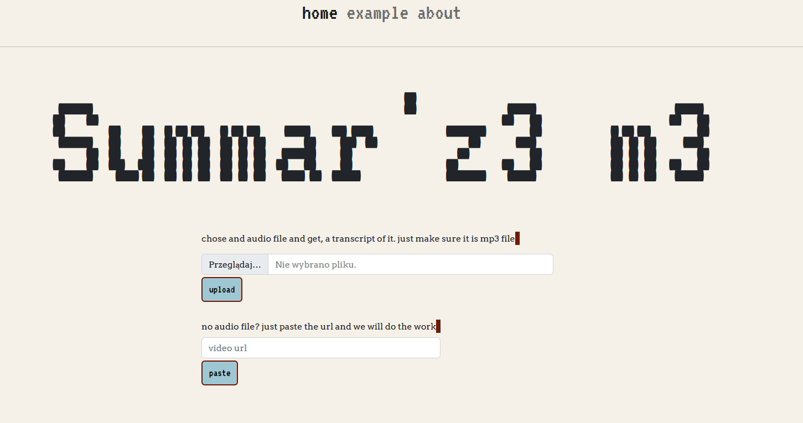
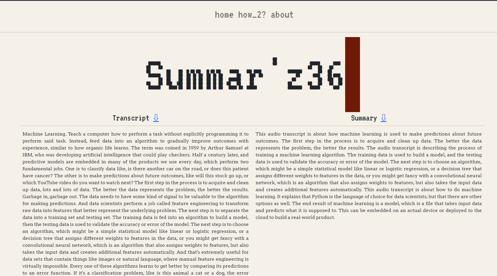

# Summ3r-y

This is a small webservice project that allows you to upload a mp3 audio while that then gets transcribed and summarized by openAi models
The project was realized  as part of OpenAI Whisper, GPT3, Codex & DALL-E 2 Hackathon together with colonelWalterKurtz and PioSikorski.

## Stack

The project uses following technologies:

- Python 3.10
- Flask for webserver.
- OpenAi python API for integration with openAi models.
  + Whisper for transcribing audio files.
  + GPT3 for summarizing the given transcript.
- various smaller python packages with common uses such as os.
## Overview

Main page contains a UI for uploading mp3 files, after submission a request is sent to openAi whisper which transcribes the audio into a text file. The transcript is then forwarded into openAi NLP Curie model which summarizes the given transcript to shorten it. 



After that is done the results are then displayed in summary page side by side with the transcripts where both files can be downloaded.



## Setup

In order to set up the environment for this project you will need to install required packages in **requirements.txt** file as well as add an ".env" file containing a variable called:
```
OPENAI_API_KEY=[you key here]
```
that contains you GPT-3 API key - without that your server will crash due to no valid access to the OpenAI 3GPT API

After that setup you should be able to run the server by simply running 
```flask run``` 
of running app.py using python like this:
```python app.py```.