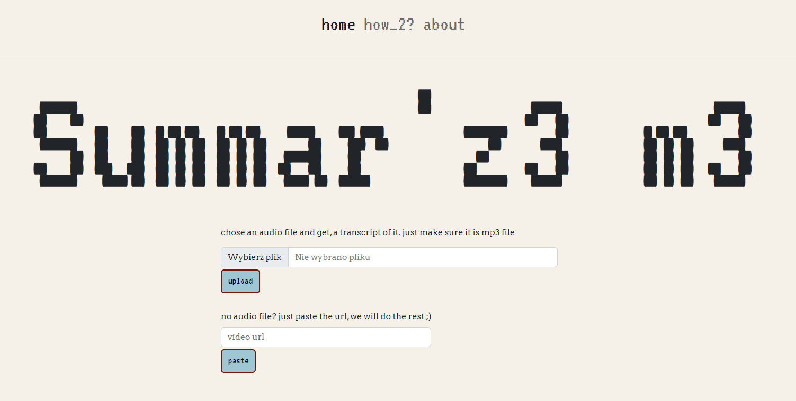

# Summ3r-y

This is a small webservice project that allows you to upload an mp3 audio while that then gets transcribed and summarized by openAi models
The project was realized  as part of openAi hackathon together with colonelWalterKurtz and PioSikorski

## Stack

The project uses following technologies:

- Python 3.10
- Flask for webserver
- OpenAi python API for integration with openAi models

## Overview

Mainpage contains a UI for uploading mp3 files, after submission a request is send to openAi whisper which transcribes the audio into a text file. The transcript is then forwarded into openAi NLP Curie model which summarizes the given transcript to shorten it. 

After that is done the results are then displayed in summary page side by side with the transcripts where both files can be downloaded.

